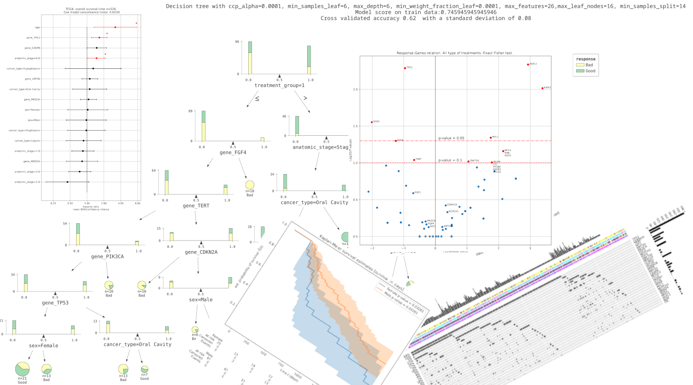
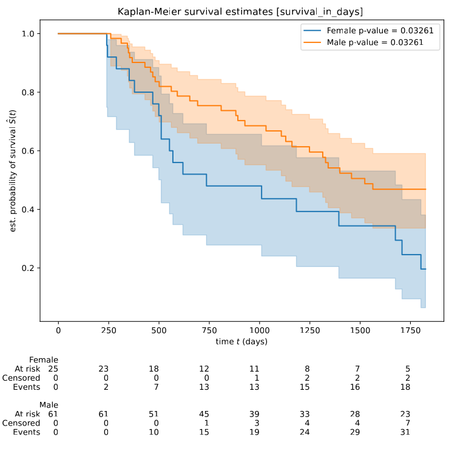
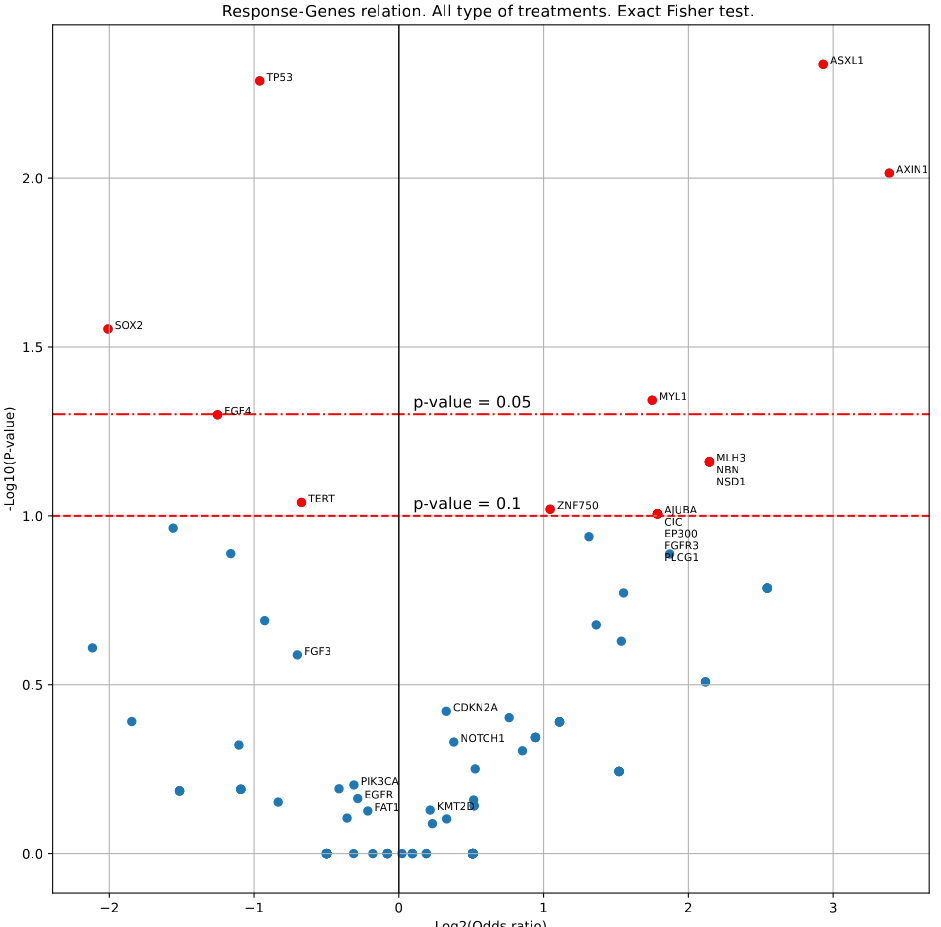
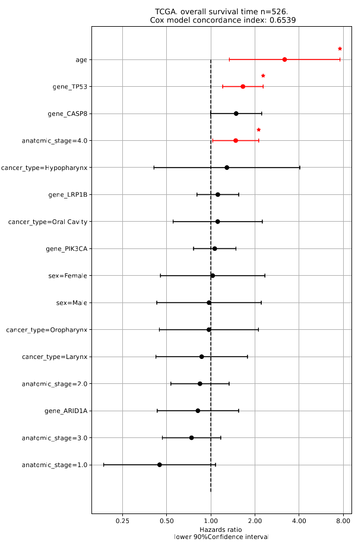
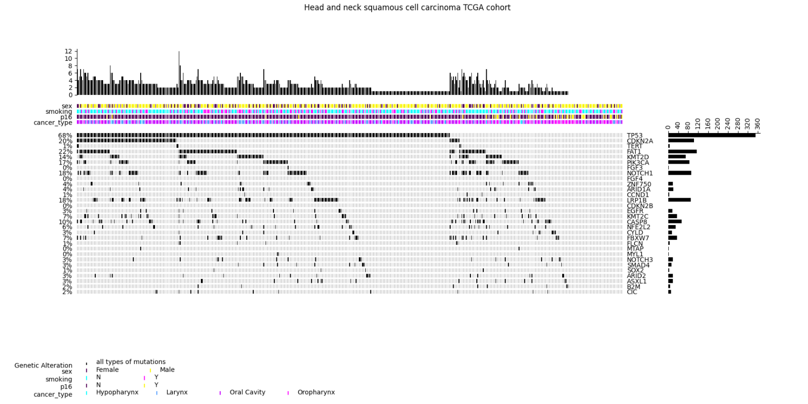
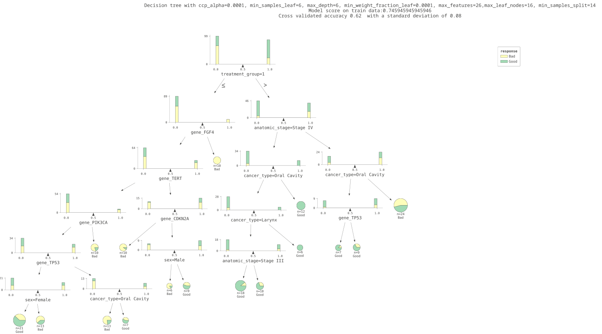

# pysurvtools (Version: 0.6.2)
A set of Python tools for survival analysis and data preparation for survival analysis.
<table>
   <tr>
      <td align="center">
         
      </td>
   </tr>
</table>

## Contents

* <b>survplots.py</b> - visualization and analysis tool built using the lifelines library for survival analysis (Davidson-Pilon, 2019). It provides easy-to-generate plots and analyses for exploring survival data, including Kaplan-Meier survival curves, value counts, histograms, boxplots with results of Kruskal-Wallis Test and Fisher's exact tests to assess relationships between binary factors and outcomes. The tool supports custom legends, data pre-filtering, and group size adjustments, making it highly adaptable for large survival studies. Outputs include various plot types and summaries that are automatically compiled into a PDF report, offering a streamlined workflow for robust survival analysis and reporting. <br>
* <b>cox-analysis.py</b> - tool, built around the lifelines library for survival analysis (Davidson-Pilon, 2019), performs survival prediction using the Cox Proportional Hazards model with support for penalization parameter tuning. The tool allows for a comprehensive analysis pipeline, including grid search optimization of penalization parameters (L1/L2 ratio) and univariate analysis to identify significant predictors. Model quality is evaluated through metrics like concordance index, log-likelihood, log-rank test, AIC, and survival probability calibration. This tool outputs detailed visual reports and summaries of significant factors influencing survival, as well as model performance plots, and can generate tailored PDF reports for streamlined survival analysis interpretation. <br>
* <b>oncoplot.py</b> -  tool is a wrapper around the pyoncoprint library (https://pubmed.ncbi.nlm.nih.gov/37037472/), designed to create customizable oncoprints for mutation data visualization. It enables users to specify genes and clinical factors of interest, with options for gene sorting and detailed annotations, including stage formatting in Roman numerals and response classifications. This tool provides flexibility for mutation markers and color-coded clinical annotations, and outputs can be saved as PDF or PNG.  <br>
* <b>adaptree.py</b> tool to construct and optimize a decision tree for analyzing treatment outcomes based on clinical data. The tool's primary feature—Bayesian hyperparameter optimization—was applied to maximize the average leaf purity, ensuring that the resulting tree effectively split cases into subgroups predominantly containing either "Good" or "Bad" responses on treatment. Also additional constraints can be set, for example constraints on minimal leaf size i.e. minimal size of subgroups that will be taken into account <br>
## Instalation

### Pre-requirements

Before installing, ensure you have the following:

- **Python 3.9 or later**: [Download Python](https://www.python.org/downloads/)
- **Git**: [Download Git](https://git-scm.com/downloads)
- **Bash-like shell**: A shell environment for running commands. This could be Git Bash (Windows), Terminal (macOS), or any Linux shell.

### Installation

1. **Clone the repository**:

   Open your shell and run:
   ```bash
   git clone https://github.com/l0andr/pysurvtools.git
   cd pysurvtools
   ```
2. **Install requirements**:

   ```  
   pip install -r requirements.txt
   ```
## Tools description

### Survplots

<table>
   <tr>
      <td>
         
      </td>
      <td>
         
      </td>
   </tr>
</table>

Usage example:
```
python survplots.py --input_csv tdf.csv --survival_time_col disease_free_time --plot kaplan_meier --max_survival_length 2000 --columns tnum,response,sex,cancer_type,alcohol_history,drugs,anatomic_stage,gene_FGF4,gene_CDKN2A,gene_MYL1,gene_ARID2 --output_pdf $output_dir/figure_6_disease_free_time_kaplan_meier.pdf --min_size_of_group 0.01 --custom_legend km_legend.json --filter_nan_columns treatment_type,response

```


<details>
     <summary>Parameters and options of survplots</summary>

| Option                   | Description                                                                                                                                                                         | Type     | Default Value       |
|--------------------------|-------------------------------------------------------------------------------------------------------------------------------------------------------------------------------------|----------|---------------------|
| `--input_csv`            | Path to the input CSV file containing survival data. This file should include relevant columns, such as patient IDs, event status, and survival time.                               | `str`    | **Required**        |
| `--output_pdf`           | Path to the output PDF file where all generated figures will be saved.                                                                                                             | `str`    | **Required**        |
| `--plot`                 | Type of plot to generate. Options include: `kaplan_meier`, `pieplots`, `floathistograms`, `valuecounts`, and `fisher_exact_test`.                                                  | `str`    | `"kaplan_meier"`    |
| `--status_col`           | Column name for the event status indicator (e.g., whether an event, such as death or relapse, has occurred).                                                                       | `str`    | `"status"`          |
| `--survival_time_col`    | Column name for survival time, usually recorded in days.                                                                                                                           | `str`    | `"survival_in_days"`|
| `--patient_id_col`       | Column name for patient IDs, useful for linking observations.                                                                                                                      | `str`    | `"patient_id"`      |
| `--columns`              | One or more specific columns to include in the plot. Separate multiple columns with commas. Supports wildcard `*` at the end to include columns starting with a specific prefix. | `str`    | `""`                |
| `--min_size_of_group`    | Minimum group size for Kaplan-Meier plots, defined as a fraction of all cases. Helps exclude small groups from analysis.                                                            | `float`  | `0.07`              |
| `--max_amount_of_groups` | Maximum number of groups per factor to display. Ensures the plot remains readable by limiting the number of groups.                                                                 | `int`    | `10`                |
| `--max_survival_length`  | Maximum time interval (in days) to consider for Kaplan-Meier plots. Any survival times beyond this will be truncated to the specified length.                                      | `float`  | `1825` (5 years)    |
| `--show`                 | If set, displays plots interactively in addition to saving them to the PDF.                                                                                                        | `flag`   | `False`             |
| `--verbose`              | Verbose level for logging output, where `0` is silent and higher numbers increase the level of detail.                                                                             | `int`    | `1`                 |
| `--custom_legend`        | Path to a JSON file containing custom legends for Kaplan-Meier plot labels. The JSON format should define group labels for each column used in the plot.                           | `str`    | `None`              |
| `--filter_nan_columns`   | Comma-separated list of columns in which NaN values will be filtered out. This helps ensure that missing data in these columns does not interfere with plotting.                   | `str`    | `""`                |
| `--title`                | Title for the plot, which will appear in the output figures.                                                                                                                       | `str`    | `""`                |

#### Plot Types

SurvPlots supports a variety of plot types, each tailored for different aspects of survival data visualization:

1. **Kaplan-Meier Plot (`kaplan_meier`)**  
   Generates Kaplan-Meier survival curves for specified groups, useful for comparing survival distributions across categories or treatment groups. This plot type supports grouping by categorical variables and allows custom legends to clarify group labels.

2. **Pie Charts (`pieplots`)**  
   Creates pie charts for categorical variables, providing an intuitive visualization of the distribution across categories. This plot is helpful for understanding the proportion of different categories within the dataset.

3. **Histograms (`floathistograms`)**  
   Plots histograms for continuous (float) variables, displaying their distribution across bins. Median values are annotated in each plot to provide a summary of the central tendency.

4. **Value Counts (`valuecounts`)**  
   Produces bar plots showing the count of each unique value in the specified columns, with percentages labeled on the bars. This plot is ideal for categorical variables, offering a clear representation of the frequency distribution.

5. **Fisher’s Exact Test (`fisher_exact_test`)**  
   Conducts Fisher’s exact test on specified binary factors and outputs a scatter plot with odds ratios and p-values. Significant associations are highlighted, with p-values and odds ratios clearly labeled, aiding in the identification of potentially important relationships between factors.

6. **Kruskal-Wallis Test (`kruskal_wallis_test`)**                                                                                                                                                                                                              
   The Kruskal-Wallis test is a non-parametric method used to determine if there are statistically significant differences between three or more groups. the plot_kruskal_wallis_boxplot
function generates boxplots for comparing multiple groups based on a continuous variable. It calculates the Kruskal-Wallis H test statistic and displays the p-value on the plot. This test helps in assessing whether there are 
significant differences in the distribution of a continuous variable across different categories or groups, providing insights into potential relationships or patterns within the data.
---
</details>

### Cox_analysis

<table>
   <tr>
      <td>
         
      </td>
   </tr>
</table>

Usage example:
```
python cox_analysis.py -input_csv 2024_transformed.csv --genes "" --factors sex,age,p16,smoking,race,cancer_type,prior_cancer,drugs,treatment_type0,total_mutations,anatomic_stage,msi_status,tmb_level,lvi,pni,smoking_packs,pdl1_category,response_0,alcohol_history --penalizer 0.01 --l1ratio 0.01 --univar "" $show --model_report $output_dir/figure_3_overall_survival_cox_univariant_factors.pdf --title "overall survival time "
```


<details>
     <summary>Parameters and options of cox_analysis</summary>

| Option                   | Description                                                                                                                                                                       | Type     | Default Value         |
|--------------------------|-----------------------------------------------------------------------------------------------------------------------------------------------------------------------------------|----------|-----------------------|
| `-input_csv`             | Path to the input CSV file containing survival data. This file should include columns like patient IDs, event status, survival time, and relevant covariates.                     | `str`    | **Required**          |
| `--min_cases`            | Minimum number of cases required for mutation columns. Genes with fewer cases are excluded from the analysis.                                                                     | `int`    | `3`                   |
| `--genes`                | Comma-separated list of genes of interest for the analysis.                                                                                                                       | `str`    | `None`                |
| `--factors`              | Comma-separated list of additional factors of interest to be included in the model.                                                                                               | `str`    | `None`                |
| `--status_col`           | Column name representing the event status (e.g., death or relapse).                                                                                                              | `str`    | `"status"`            |
| `--survival_time_col`    | Column name representing survival time, typically recorded in days.                                                                                                              | `str`    | `"survival_in_days"`  |
| `--patient_id_col`       | Column name for patient IDs to ensure observations are properly tracked.                                                                                                          | `str`    | `"patient_id"`        |
| `--calib_t0`             | Time used for model calibration in survival probability calculations.                                                                                                             | `int`    | `1900`                |
| `--l1ratio`              | Ratio of L1 regularization in the Cox model’s penalty. If negative, a grid search is performed to optimize this value.                                                            | `float`  | `-1`                  |
| `--penalizer`            | Penalization parameter for the Cox model optimizer. If negative, a grid search is performed to find the optimal value.                                                            | `float`  | `-1`                  |
| `--opt_report`           | Path for saving the optimization report PDF, detailing results from grid search and parameter tuning.                                                                             | `str`    | `"cox_optim_report.pdf"` |
| `--model_report`         | Path for saving the model report PDF, including model summary and statistical tests.                                                                                              | `str`    | `"cox_model_report.pdf"`  |
| `--univar`               | If set, performs univariate analysis on specified factors, varying each factor in isolation.                                                                                      | `str`    | `None`                |
| `--verbose`              | Verbose level for logging output, where `0` is silent and higher numbers increase the level of detail.                                                                            | `int`    | `1`                   |
| `--show`                 | If set, displays plots interactively in addition to saving them to the PDF.                                                                                                       | `flag`   | `False`               |
| `--plot_outcome`         | If set, generates and displays plots of partial effects on the outcome.                                                                                                          | `flag`   | `False`               |
| `--filter_nan`           | If set, removes rows with NaN values across gene and factor columns.                                                                                                              | `flag`   | `False`               |
| `--filter_nan_columns`   | Comma-separated list of columns to filter out NaN values from, ensuring completeness in specific variables.                                                                      | `str`    | `""`                  |
| `--title`                | Title for the plot, which will appear in the output figures.                                                                                                                      | `str`    | `""`                  |

#### Cox-Analysis Plot Types and Outputs

The **Cox-Analysis** tool, built around the **lifelines** library for survival analysis ([Davidson-Pilon, 2019](https://doi.org/10.21105/joss.01317)), supports various plots and statistical summaries for analyzing survival data:

1. **Univariate Analysis Plot**  
   Conducts univariate Cox regression for each specified factor individually, allowing visualization of the hazard ratios and confidence intervals. This plot highlights factors with significant effects on survival, helping to identify potential predictors for further analysis.

2. **Grid Search Optimization Heatmaps**  
   When L1 ratio and penalizer values are set to `-1`, the tool performs a grid search and generates heatmaps of model performance metrics (e.g., concordance index, log-likelihood) across different parameter combinations. These plots provide insights into optimal penalization settings for the Cox model.

3. **Model Summary and Tree Plot**  
   Once the model is fit, the tool generates a forest plot of significant factors with hazard ratios and confidence intervals. This summary plot visually conveys the risk associated with each factor, aiding in the interpretation of multivariate results.
 
</details>        

### oncoplot

<table>
   <tr>
      <td>
         
      </td>
   </tr>
</table>

Usage example:
```
python oncoplot.py -input_mutation tcga_data2.csv -output_file $output_dir/figure_2_TCGA_oncoplot.pdf -list_of_factors sex,smoking,cancer_type $show --number_of_genes 30 -list_of_genes TP53,CDKN2A,TERT,FAT1,KMT2D,PIK3CA,FGF3,NOTCH1,FGF4,ZNF750,ARID1A,CCND1,LRP1B,CDKN2B,EGFR,KMT2C,CASP8,NFE2L2,CYLD,FBXW7,FLCN,MTAP,MYL1,NOTCH3,SMAD4,SOX2,B2M,ARID2,ASXL1,CIC --verbose 1 --nosortgenes --title "Oncoplot TCGA cohort"
```
<details>
     <summary>Parameters and options of oncoplot</summary>

   ## pyoncoplot Tool Options

| Option               | Description                                                                                                                                                        | Type     | Default Value       |
|----------------------|--------------------------------------------------------------------------------------------------------------------------------------------------------------------|----------|---------------------|
| `-input_mutation`    | Path to the input file containing mutation data. This file should include columns like `patient_id` and columns for gene mutation statuses.                       | `str`    | **Required**        |
| `-output_file`       | Path to the output file where the oncoplot will be saved. Accepts `.pdf` or `.png` file formats.                                                                   | `str`    | **Required**        |
| `-list_of_factors`   | Comma-separated list of clinical or categorical factors to display as annotations above the oncoplot.                                                             | `str`    | **Required**        |
| `-list_of_genes`     | Comma-separated list of specific genes to display on the oncoplot. Only these genes will be included, if provided.                                                | `str`    | `""`                |
| `--nosortgenes`      | If set, disables sorting of genes on the plot. By default, genes are sorted by mutation frequency.                                                                | `flag`   | `False`             |
| `--show`             | If set, displays the oncoplot interactively in addition to saving it to a file.                                                                                   | `flag`   | `False`             |
| `--number_of_genes`  | Number of genes to display on the plot, selected based on mutation frequency if `-list_of_genes` is not specified.                                                | `int`    | `20`                |
| `--verbose`          | Verbose level for logging output, where `0` is silent and higher numbers increase the level of detail.                                                            | `int`    | `1`                 |
| `--title`            | Title for the oncoplot, which will appear at the top of the figure.                                                                                               | `str`    | `""`                |

## pyoncoplot Plot Features and Annotations

The **pyoncoplot** tool, based on the **pyoncoprint** library ([PubMed link](https://pubmed.ncbi.nlm.nih.gov/37037472/)), generates oncoprints for visualizing mutation data across patients and genes. It allows for customization and includes various options for annotations and formatting:

1. **Oncoplot Display of Mutation Types**  
   The oncoplot represents mutations across patients for each specified gene, with mutation types marked by distinct symbols. Genes with frequent mutations are highlighted by default. Users can also provide a specific list of genes for display, ensuring that only relevant genes are shown.

2. **Sorting and Selection of Genes**  
   Genes can be automatically sorted by mutation frequency, or users can disable sorting (`--nosortgenes`) to retain the order from the input file. Additionally, users can limit the number of genes displayed using `--number_of_genes`, helping to focus on the most impactful mutations.

3. **Clinical Annotations Above the Plot**  
   Clinical factors (e.g., stage, response) specified with `-list_of_factors` are added as annotations above the oncoplot. These annotations are color-coded based on unique values, with automatic replacement of values (e.g., stages represented as Roman numerals, response classifications) for easier interpretation.

4. **Color-Coded Legends for Annotations**  
   A color legend is automatically generated for each annotated factor, providing clarity on categories such as stages or treatment responses. The color maps are customizable and automatically adjust to fit unique values for each annotation.

5. **Output as PDF or PNG**  
   The oncoplot can be saved as a PDF (multi-page) or PNG (single image) file, making it easy to incorporate into reports or presentations. The tool also supports interactive viewing with `--show` for detailed examination.

</details>

### Adaptree


<table>
   <tr>
      <td>
         
      </td>
   </tr>
</table>


`adaptree.py` is a command-line tool designed to facilitate decision tree modeling, preprocessing, and optimization. It provides a flexible way to preprocess data, train decision tree classifiers, and visualize the results using tools like `dtreeviz`. Additionally, the script includes support for hyperparameter optimization through Gaussian process minimization.

<details>
     <summary>Parameters and options of adaptree</summary>
   
#### Key Features
- **Data Preprocessing**:
  - Categorical variable renaming and one-hot encoding.
  - Automatic handling of missing values by median imputation.
  - Filtering rows based on NaN values in specified columns.
- **Model Training**:
  - Decision tree training with configurable hyperparameters like `max_depth`, `min_samples_leaf`, and `ccp_alpha`.
  - Supports loading and saving models in `.pickle` format.
- **Hyperparameter Optimization**:
  - Uses Bayesian optimization to find the best parameters for decision tree models.
- **Visualization**:
  - Creates decision tree visualizations using `plot_tree` or `dtreeviz`.

#### Usage Example
```bash
python adaptree.py -input_csv data.csv -ycolumn target_column --xcolumns feature1,feature2,feature3 --filter_nan_columns feature1 --output_model tree_model.pkl --verbose 2 --min_weight_fraction_leaf 0.02 --max_depth 10 --criteria entropy
```
| Option                     | Description                                                                                                            | Type     | Default Value       |
|----------------------------|------------------------------------------------------------------------------------------------------------------------|----------|---------------------|
| `-input_csv`               | Path to the input CSV file containing the dataset.                                                                    | `str`    | **Required**        |
| `--input_delimiter`        | Delimiter for the input file.                                                                                         | `str`    | `","`               |
| `-ycolumn`                 | Feature that should be predicted (target variable).                                                                   | `str`    | **Required**        |
| `--xcolumns`               | Comma-separated list of features to be used for splitting branches.                                                   | `str`    | `""`                |
| `--sort_columns`           | Columns for pre-sorting data before processing.                                                                       | `str`    | `""`                |
| `--unique_record`          | List of columns to identify unique records.                                                                           | `str`    | `""`                |
| `--model`                  | Path to a file containing the pre-trained model. If set, only plots will be created.                                  | `str`    | `""`                |
| `--random_seed`            | Random seed for model training.                                                                                       | `int`    | `None`              |
| `--verbose`                | Verbosity level for logging output.                                                                                   | `int`    | `2`                 |
| `--show`                   | If set, displays plots interactively.                                                                                 | `flag`   | `False`             |
| `--class_names`            | List of class names for visualization.                                                                                | `str`    | `""`                |
| `--output_model`           | File path to save the output model.                                                                                    | `str`    | `""`                |
| `--custom_legend`          | Path to a JSON file with custom legends for plots.                                                                    | `str`    | `None`              |
| `--min_weight_fraction_leaf` | Minimum weighted fraction of the sum total of weights required at a leaf node.                                       | `float`  | `None`              |
| `--min_samples_leaf`       | Minimum number of samples required at a leaf node.                                                                    | `int`    | `None`              |
| `--max_depth`              | Maximum depth of the decision tree.                                                                                   | `int`    | `None`              |
| `--ccp_alpha`              | Complexity parameter used for Minimal Cost-Complexity Pruning.                                                        | `float`  | `None`              |
| `--min_impurity_decrease`  | Minimum impurity decrease required for a node split.                                                                  | `float`  | `None`              |
| `--max_features`           | Number of features to consider for the best split.                                                                    | `int`    | `None`              |
| `--max_leaf_nodes`         | Maximum number of leaf nodes to grow in best-first fashion.                                                           | `int`    | `None`              |
| `--min_samples_split`      | Minimum number of samples required to split an internal node.                                                         | `int`    | `None`              |
| `--criteria`               | Function to measure the quality of a split (`gini` or `entropy`).                                                     | `str`    | `"gini"`            |
| `--plot_type`              | Type of plot to generate (`simple`, `simple_full`, or `dtreeviz`).                                                    | `str`    | `"simple"`          |
| `--tiff`                   | File name for the output plot in TIFF format.                                                                         | `str`    | `""`                |
| `--steps_of_optimization`  | Number of steps for hyperparameter optimization.                                                                      | `int`    | `20`                |
| `--filter_nan_columns`     | Comma-separated list of columns where NaN values will be detected and filtered.                                       | `str`    | `""`                |


#### Outputs
- Trained Model: Saved in .pickle format if specified via --output_model. <br>
- Visualizations: Decision tree visualizations, including dtreeviz for advanced graphics.<br>
- Optimization Summary: Outputs the best hyperparameters and their performance during optimization. <br>
</details>
